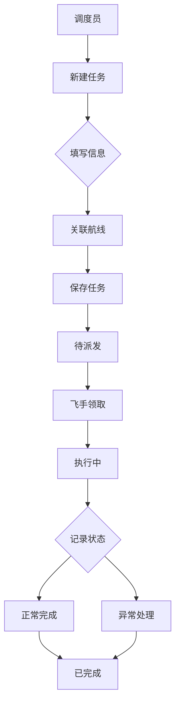

## 1. Product Overview
飞行任务调度Web应用是为低空运营单位设计的无人机任务管理系统，支持任务创建、航线规划、资源调度和执行监控，提升无人机巡检、拍摄和物资投送任务的管理效率。

## 2. Core Features

### 2.1 User Roles
| Role | Registration Method | Core Permissions |
|------|---------------------|------------------|
| 管理员 | 系统配置 | 完整权限，包括用户管理和系统设置 |
| 调度员 | 账号密码 | 创建任务、规划航线、分配资源 |
| 飞手 | 账号密码 | 执行任务、记录状态、上传照片 |

### 2.2 Feature Module
1. **任务看板**: 展示待派发、执行中、已完成任务状态的看板视图
2. **新建任务**: 创建任务表单，填写地点、时间、机型、载荷、人员等信息
3. **航线规划**: 支持标点、分段、里程估算和风险提示的航线编辑页面
4. **资源日历**: 查看飞手、设备、电池占用情况的日历视图
5. **任务执行**: 记录起飞、返航、异常和现场照片的执行页面
6. **统计报表**: 按任务类型、完成率、延误原因汇总，支持导出任务单

### 2.3 Page Details
| Page Name | Module Name | Feature description |
|-----------|-------------|---------------------|
| 任务看板 | 看板视图 | 三列卡片式布局展示待派发、执行中、已完成任务，支持拖拽排序 |
| 任务看板 | 任务卡片 | 显示任务基本信息、状态标签、优先级标识 |
| 新建任务 | 表单 | 任务名称、地点、时间、机型、载荷类型、指派飞手等字段 |
| 新建任务 | 航线关联 | 可选择或新建航线 |
| 航线规划 | 地图标点 | 在地图上标记起点、途经点、终点 |
| 航线规划 | 分段管理 | 支持航线分段编辑、删除、调整顺序 |
| 航线规划 | 里程估算 | 自动计算航线总里程和预计飞行时间 |
| 航线规划 | 风险提示 | 根据禁飞区、高度限制等规则提示风险区域 |
| 资源日历 | 日历视图 | 月视图展示飞手、设备、电池的占用情况 |
| 资源日历 | 筛选功能 | 按资源类型筛选查看 |
| 任务执行 | 状态记录 | 记录起飞时间、返航时间、任务完成情况 |
| 任务执行 | 异常记录 | 记录飞行过程中的异常事件和处理措施 |
| 任务执行 | 照片上传 | 支持现场照片拍摄和上传 |
| 统计报表 | 数据汇总 | 按任务类型统计、完成率计算、延误原因分析 |
| 统计报表 | 导出功能 | 支持导出任务单为Excel或PDF格式 |

## 3. Core Process

### 3.1 任务创建流程
1. 调度员进入新建任务页面
2. 填写任务基本信息（名称、地点、时间、机型、载荷）
3. 指派飞手和设备
4. 关联或创建航线
5. 保存任务，任务状态变为待派发

### 3.2 任务执行流程
1. 飞手在任务看板中领取任务
2. 任务状态变为执行中
3. 飞手记录起飞时间
4. 执行任务过程中可记录异常和上传照片
5. 任务完成后记录返航时间，任务状态变为已完成

### 3.3 流程图

## 4. User Interface Design

### 4.1 Design Style
- **主色调**: 深蓝色系 (#1e3a5f)，体现专业、科技感
- **辅助色**: 橙色 (#f97316)，用于强调和交互元素
- **状态色**: 绿色表示成功/完成，黄色表示警告/执行中，红色表示异常/危险
- **按钮样式**: 圆角矩形，hover效果带有阴影和颜色加深
- **字体**: 中文使用思源黑体，英文使用Inter
- **布局**: 侧边栏导航 + 主内容区的经典管理后台布局
- **图标风格**: 线性图标，统一使用Lucide图标库

### 4.2 Page Design Overview
| Page Name | Module Name | UI Elements |
|-----------|-------------|-------------|
| 任务看板 | 看板视图 | 三列布局，卡片式任务展示，拖拽交互，状态标签，优先级标识 |
| 新建任务 | 表单 | 分组表单，日期时间选择器，下拉选择框，航线选择器 |
| 航线规划 | 地图 | 地图组件，标记点，路径绘制，信息弹窗 |
| 资源日历 | 日历 | 月视图网格，资源卡片，颜色区分占用状态 |
| 任务执行 | 记录表单 | 时间戳记录，异常下拉选择，照片上传区域 |
| 统计报表 | 图表 | 饼图、柱状图、数据表格，导出按钮 |

### 4.3 Responsiveness
- **桌面端**: 完整功能展示，侧边栏固定展开
- **平板端**: 侧边栏可折叠，布局自适应
- **移动端**: 底部导航，简化功能展示

### 4.4 3D Scene Guidance
无3D场景需求