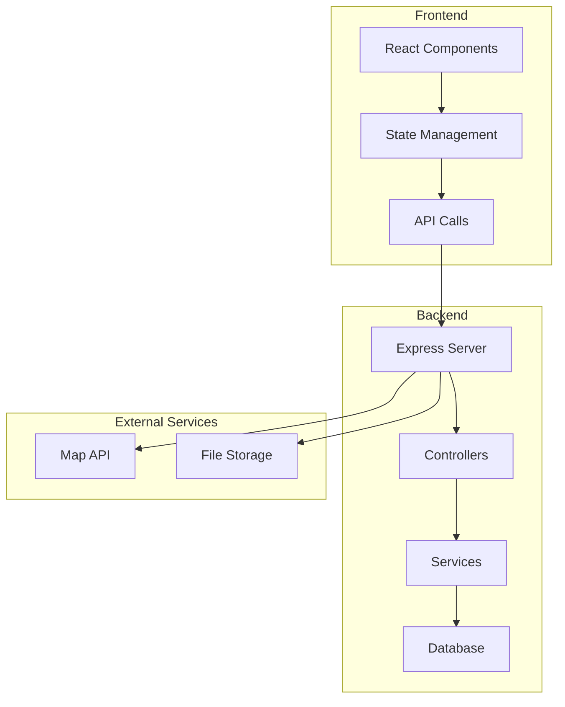
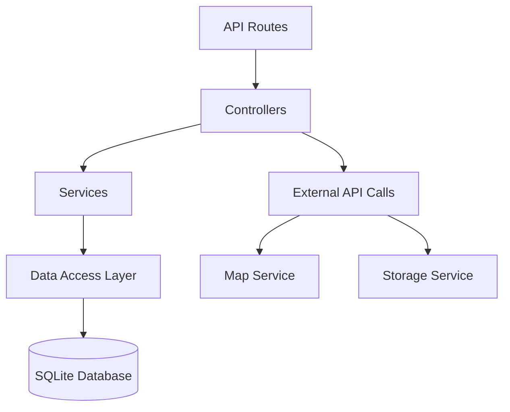
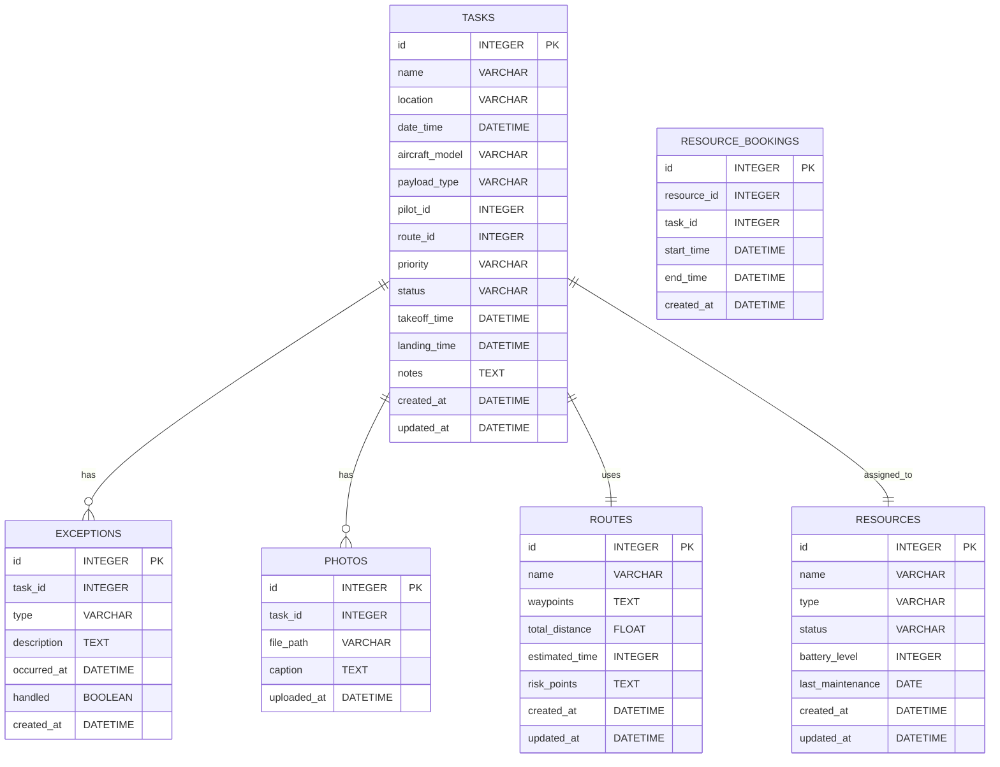

## 1. Architecture Design



## 2. Technology Description
- **Frontend**: React@18 + TypeScript + TailwindCSS@3 + Vite
- **Initialization Tool**: vite-init
- **Backend**: Express@4 + TypeScript
- **Database**: SQLite (嵌入式，便于部署)
- **State Management**: Zustand
- **Routing**: React Router DOM
- **Icons**: Lucide React

## 3. Route Definitions
| Route | Purpose | Component |
|-------|---------|-----------|
| / | 任务看板首页 | TaskBoard |
| /tasks/new | 新建任务 | NewTask |
| /tasks/:id | 任务详情/执行 | TaskExecution |
| /routes | 航线管理 | RouteManagement |
| /routes/new | 新建航线 | NewRoute |
| /routes/:id | 航线详情 | RouteDetail |
| /resources | 资源日历 | ResourceCalendar |
| /statistics | 统计报表 | Statistics |

## 4. API Definitions

### 4.1 Tasks API

#### GET /api/tasks
获取任务列表
- Query params: status (pending/active/completed), page, limit
- Response: { tasks: Task[], total: number }

#### POST /api/tasks
创建任务
- Request body: { name, location, dateTime, aircraftModel, payloadType, pilotId, routeId, priority }
- Response: { task: Task }

#### GET /api/tasks/:id
获取任务详情
- Response: { task: Task }

#### PUT /api/tasks/:id
更新任务
- Request body: { status, takeoffTime, landingTime, notes }
- Response: { task: Task }

#### DELETE /api/tasks/:id
删除任务
- Response: { success: boolean }

### 4.2 Routes API

#### GET /api/routes
获取航线列表
- Response: { routes: Route[] }

#### POST /api/routes
创建航线
- Request body: { name, waypoints, totalDistance, estimatedTime }
- Response: { route: Route }

#### GET /api/routes/:id
获取航线详情
- Response: { route: Route }

#### PUT /api/routes/:id
更新航线
- Request body: { name, waypoints, totalDistance, estimatedTime }
- Response: { route: Route }

#### DELETE /api/routes/:id
删除航线
- Response: { success: boolean }

### 4.3 Resources API

#### GET /api/resources
获取资源列表
- Query params: type (pilot/equipment/battery)
- Response: { resources: Resource[] }

#### GET /api/resources/availability
查询资源可用性
- Request body: { resourceIds, dateTime, duration }
- Response: { available: Resource[], unavailable: Resource[] }

### 4.4 Statistics API

#### GET /api/statistics/tasks
获取任务统计
- Query params: startDate, endDate
- Response: { byType, completionRate, delayReasons }

#### GET /api/statistics/export
导出任务单
- Query params: startDate, endDate, format (excel/pdf)
- Response: File download

## 5. Server Architecture Diagram



## 6. Data Model

### 6.1 Data Model Definition



### 6.2 Data Definition Language

```sql
CREATE TABLE tasks (
    id INTEGER PRIMARY KEY AUTOINCREMENT,
    name VARCHAR(255) NOT NULL,
    location VARCHAR(255),
    date_time DATETIME NOT NULL,
    aircraft_model VARCHAR(100),
    payload_type VARCHAR(50),
    pilot_id INTEGER,
    route_id INTEGER,
    priority VARCHAR(20) DEFAULT 'medium',
    status VARCHAR(20) DEFAULT 'pending',
    takeoff_time DATETIME,
    landing_time DATETIME,
    notes TEXT,
    created_at DATETIME DEFAULT CURRENT_TIMESTAMP,
    updated_at DATETIME DEFAULT CURRENT_TIMESTAMP
);

CREATE TABLE routes (
    id INTEGER PRIMARY KEY AUTOINCREMENT,
    name VARCHAR(255) NOT NULL,
    waypoints TEXT NOT NULL,
    total_distance FLOAT,
    estimated_time INTEGER,
    risk_points TEXT,
    created_at DATETIME DEFAULT CURRENT_TIMESTAMP,
    updated_at DATETIME DEFAULT CURRENT_TIMESTAMP
);

CREATE TABLE resources (
    id INTEGER PRIMARY KEY AUTOINCREMENT,
    name VARCHAR(255) NOT NULL,
    type VARCHAR(20) NOT NULL,
    status VARCHAR(20) DEFAULT 'available',
    battery_level INTEGER,
    last_maintenance DATE,
    created_at DATETIME DEFAULT CURRENT_TIMESTAMP,
    updated_at DATETIME DEFAULT CURRENT_TIMESTAMP
);

CREATE TABLE resource_bookings (
    id INTEGER PRIMARY KEY AUTOINCREMENT,
    resource_id INTEGER NOT NULL,
    task_id INTEGER NOT NULL,
    start_time DATETIME NOT NULL,
    end_time DATETIME NOT NULL,
    created_at DATETIME DEFAULT CURRENT_TIMESTAMP,
    FOREIGN KEY (resource_id) REFERENCES resources(id),
    FOREIGN KEY (task_id) REFERENCES tasks(id)
);

CREATE TABLE exceptions (
    id INTEGER PRIMARY KEY AUTOINCREMENT,
    task_id INTEGER NOT NULL,
    type VARCHAR(50) NOT NULL,
    description TEXT,
    occurred_at DATETIME NOT NULL,
    handled BOOLEAN DEFAULT FALSE,
    created_at DATETIME DEFAULT CURRENT_TIMESTAMP,
    FOREIGN KEY (task_id) REFERENCES tasks(id)
);

CREATE TABLE photos (
    id INTEGER PRIMARY KEY AUTOINCREMENT,
    task_id INTEGER NOT NULL,
    file_path VARCHAR(255) NOT NULL,
    caption TEXT,
    uploaded_at DATETIME DEFAULT CURRENT_TIMESTAMP,
    FOREIGN KEY (task_id) REFERENCES tasks(id)
);

INSERT INTO resources (name, type, status) VALUES
('张飞行员', 'pilot', 'available'),
('李飞行员', 'pilot', 'available'),
('王飞行员', 'pilot', 'available'),
('无人机-A001', 'equipment', 'available'),
('无人机-A002', 'equipment', 'available'),
('无人机-A003', 'equipment', 'available'),
('电池-B001', 'battery', 'available'),
('电池-B002', 'battery', 'available'),
('电池-B003', 'battery', 'available'),
('电池-B004', 'battery', 'available');

INSERT INTO routes (name, waypoints, total_distance, estimated_time) VALUES
('工业园区巡检路线', '[{"lat":31.2304,"lng":121.4737,"name":"起点"},{"lat":31.2350,"lng":121.4800,"name":"途经点1"},{"lat":31.2400,"lng":121.4850,"name":"途经点2"},{"lat":31.2380,"lng":121.4900,"name":"终点"}]', 5.2, 15),
('农田监测路线', '[{"lat":31.2000,"lng":121.5000,"name":"起点"},{"lat":31.2050,"lng":121.5100,"name":"途经点1"},{"lat":31.2100,"lng":121.5050,"name":"终点"}]', 3.8, 10);
```

## 7. Project Structure

```
src/
├── components/          # 通用组件
│   ├── Layout/         # 布局组件
│   ├── Sidebar/        # 侧边栏导航
│   ├── TaskCard/       # 任务卡片
│   ├── RouteMap/       # 地图组件
│   └── Calendar/       # 日历组件
├── pages/              # 页面组件
│   ├── TaskBoard/      # 任务看板
│   ├── NewTask/        # 新建任务
│   ├── TaskExecution/  # 任务执行
│   ├── RouteManagement/# 航线管理
│   ├── ResourceCalendar/# 资源日历
│   └── Statistics/     # 统计报表
├── store/              # Zustand状态管理
│   └── taskStore.ts
├── api/                # API调用
│   └── index.ts
├── types/              # TypeScript类型定义
│   └── index.ts
├── utils/              # 工具函数
│   └── index.ts
├── App.tsx
├── main.tsx
└── index.css
```

## 8. Development Guidelines

### 8.1 Code Quality
- 使用 TypeScript 进行类型安全检查
- 组件文件不超过 300 行
- 遵循 ESLint 和 Prettier 规范

### 8.2 Security
- 使用参数化查询防止 SQL 注入
- 对用户输入进行验证和清理
- 敏感数据加密存储

### 8.3 Performance
- 使用 React.memo 优化组件渲染
- 实现分页加载
- 使用 CDN 加速静态资源

### 8.4 Testing
- 使用 Jest 进行单元测试
- 覆盖核心业务逻辑
- 定期运行测试套件